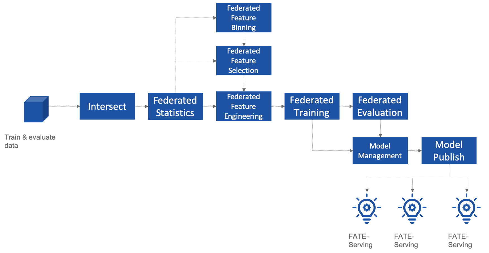
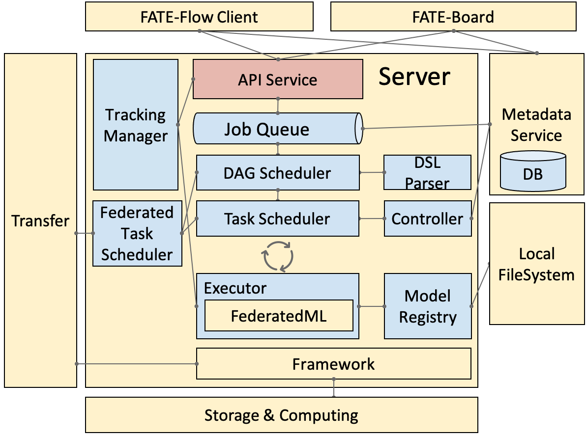

---
FATE FLOW
---

简介
====

FATE-Flow是联邦学习框架FATE的作业调度系统，实现联邦学习作业生命周期的完整管理，其中包括数据输入、训练作业调度、指标追踪、模型中心等功能.

FATE-Flow关键点:
------------------

-   使用DAG定义Pipeline；
-   使用 JSON 格式的 FATE-DSL 描述DAG, 支持系统自动化对接；
-   先进的调度框架，基于全局状态和乐观锁调度，单方DAG调度，多方协调调度，并支持多调度器
-   灵活的调度策略，支持启动/停止/重跑等
-   细粒度的资源调度能力，依据不同计算引擎支持核数、内存、工作节点策略
-   实时追踪器，运行期间实时跟踪数据, 参数, 模型和指标
-   联邦模型中心, 模型管理、联邦一致性、导入导出、集群间迁移
-   提供CLI、HTTP API、Python SDK

架构
====

{.align-center}

部署
====

[README](../../README_zh.md)

用法
====

##### [命令行](./doc/fate_flow_cli_v2_guide.md)

##### [Python SDK](./doc/Fate_Flow_Client_SDK_Guide.md)

##### [HTTP API](./doc/fate_flow_http_api.rst)

##### [训练样例](../../examples/README_zh.rst)

##### [在线推理样例](../../doc/model_publish_with_serving_guide_zh.md)

日志
====

FATE-Flow服务日志

`$PROJECTBASE/logs/fate_flow/`

任务日志

`$PROJECTBASE/logs/$job_id/`

常见问题
========

FATE-FLOW在FATE中的作用以及代表的意义是什么

:   FATE Flow是调度系统，根据用户提交的作业DSL，调度算法组件执行

ModuleNotFoundError

:   No module named "arch": 将PYTHONPATH设置为fate_flow目录的父目录。

提交任务时, 为什么任务显示成功, 但是在dashboard页面上任务失败?

:   命令"submit_job"只是提交任务，"success"代表的是任务提交成功，任务失败后可以通过日志来查看。

guest, host, arbiter和local在FATE中的作用以及代表的意义是什么？

:   

> -   arbiter是用来辅助多方完成联合建模的，它的主要作用是聚合梯度或者模型。比如纵向lr里面，各方将自己一半的梯度发送给arbiter，然后arbiter再联合优化等等。
> -   guest代表数据应用方。
> -   host是数据提供方。
> -   local是指本地任务, 该角色仅用于upload和download阶段中。

杀死(kill)等待的作业(job) 时出现有关"cannot find xxxx"的错误

:   Fate_flow目前仅支持在任务发起方进行kill，其它方kill会显示"cannot
    find xxxx"。

upload命令在做什么？

:   Upload data是上传到eggroll里面，变成后续算法可执行的DTable格式。

如何下载执行过程中生成的数据？

:   您可以使用`python fate_flow_client.py -f component_output_model -j $job_id -r $role -g $guest -cpn $component_name -o $output_path`

如果同一文件上传执行了两次, FATE将删除第一个数据并再次上传吗？

:   如果同一表的键相同, 它的值将被覆盖。

任务失败而在board上没有错误显示的原因是什么？

:   这些日志不会显示在board上展示:`$job_id/fate_flow_schedule.log`,
    `logs/error.log`, `logs/fate_flow/ERROR.log` .

load和bind命令有什么区别？

:   load可以理解为发送模型到模型服务上, 而bind是绑定一个模型到模型服务。
