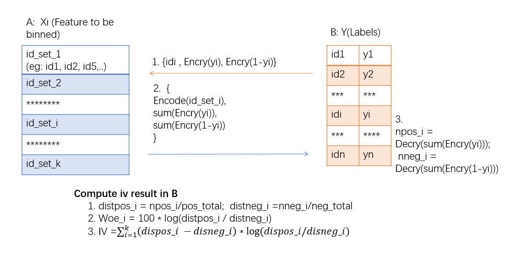
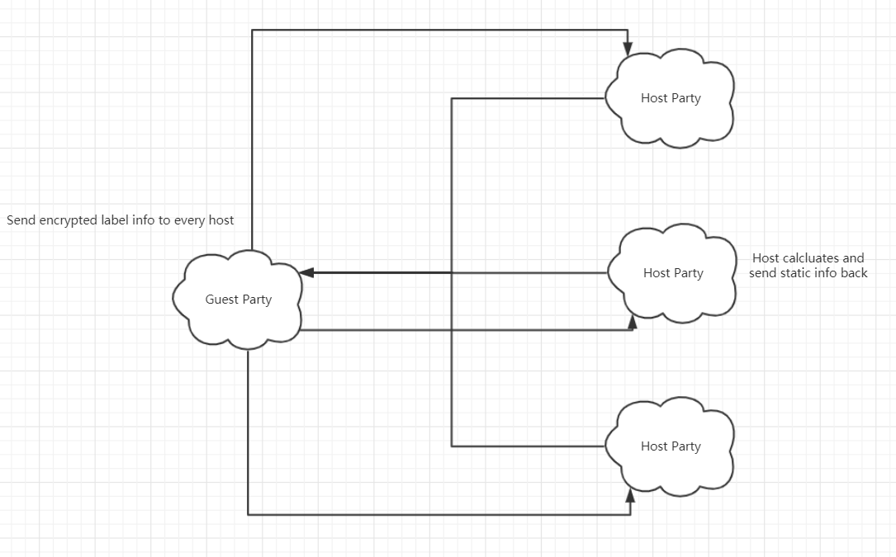
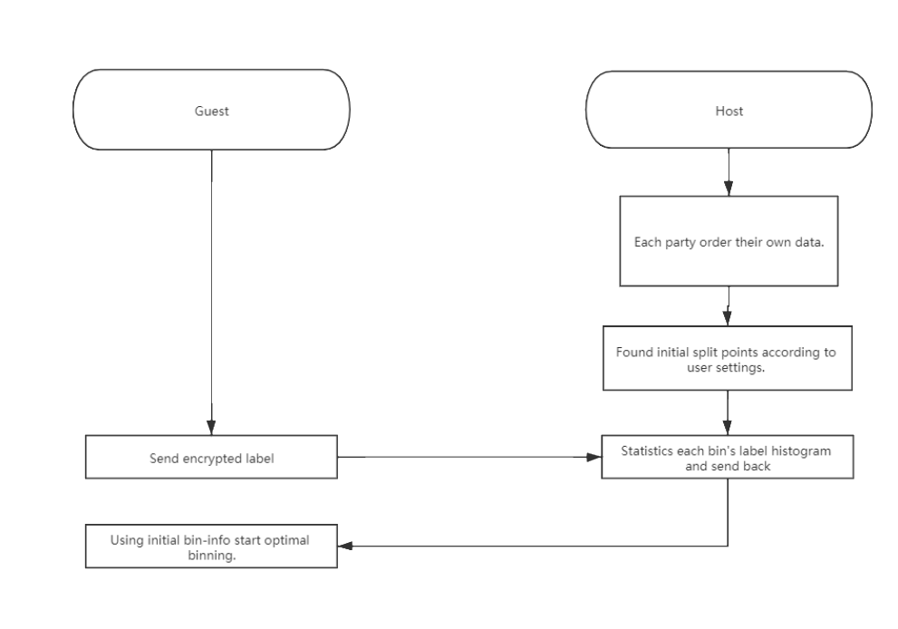
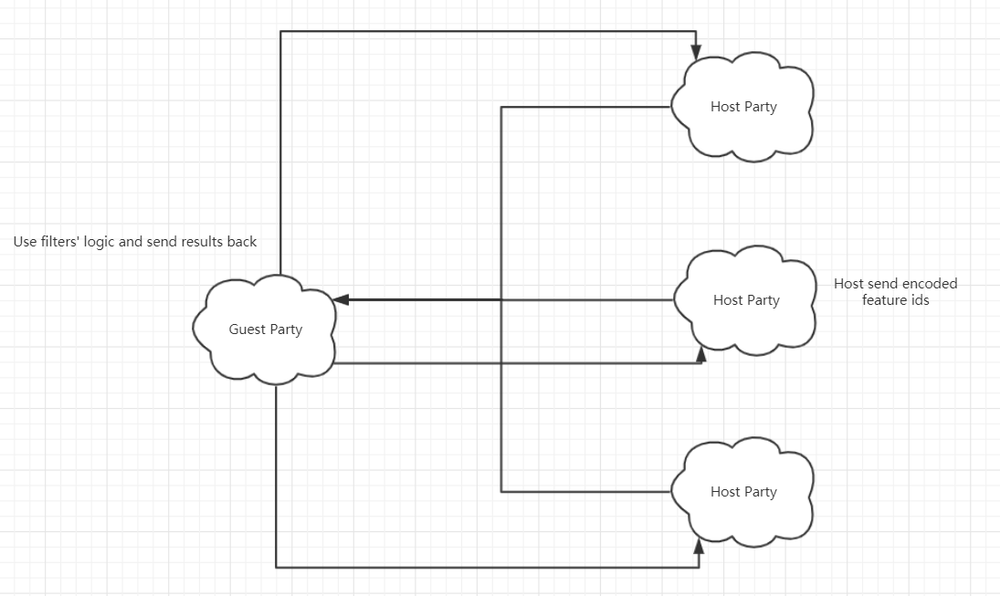
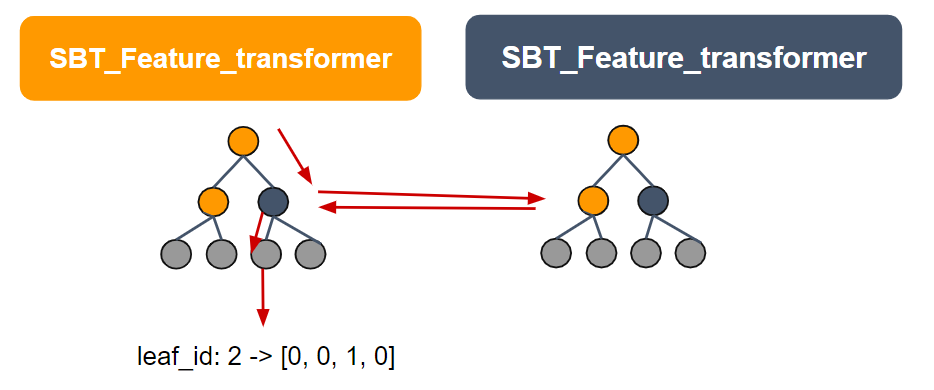

Hetero Feature Binning
======================

Feature binning or data binning is a data pre-processing technique. It can be use to reduce the effects of minor observation errors, calculate information values and so on.

Currently, we provide quantile binning and bucket binning methods. To achieve quantile binning approach, we have used a special data structure mentioned in this `[paper] <https://www.researchgate.net/profile/Michael_Greenwald/publication/2854033_Space-Efficient_Online_Computation_of_Quantile_Summaries/links/0f317533ee009cd3f3000000/Space-Efficient-Online-Computation-of-Quantile-Summaries.pdf>`_. Feel free to check out the detail algorithm in the paper.

As for calculating the federated iv and woe values, the following figure can describe the principle properly.

   Figure 1 (Federated Feature Binning Principle)

As the figure shows, B party which has the data labels encrypt its labels with Addiction homomorphic encryption and then send to A. A static each bin's label sum and send back. Then B can calculate woe and iv base on the given information.

For multiple hosts, it is similar with one host case. Guest sends its encrypted label information to all hosts, and each of the hosts calculates and sends back the static info.

   Figure 2： Multi-Host Binning Principle

For optimal binning, each party use quantile binning or bucket binning find initial split points. Then Guest will send encrypted labels to Host. Host use them calculate histogram of each bin and send back to Guest. Then start optimal binning methods.

   Figure 3： Multi-Host Binning Principle

There exist two kinds of methods, merge-optimal binning and split-optimal binning. When choosing metrics as iv, gini or chi-square, merge type optimal binning will be used. On the other hand, if ks is choosed, split type optimal binning will be used.

Param
------

.. automodule:: federatedml.param.feature_binning_param
   :members:

Features
--------

1. Support Quantile Binning based on quantile summary algorithm.

2. Support Bucket Binning.

3. Support missing value input by ignoring them.

4. Support sparse data format generated by dataio component.

5. Support calculating woe and iv as well as counting positive and negative cases for each bin.

6. Support transforming data into bin indexes.

7. Support multiple hosts binning.

8. Support 4 types of optimal binning.

9. Support asymmetric binning methods on Host & Guest sides.

Hetero Feature Selection
========================

Feature selection is a process that selects a subset of features for model construction. Take good advantage of feature selection can improve model performance.

In this version, we provide several filter methods for feature selection.

Param
------

.. automodule:: federatedml.param.feature_selection_param
   :members:

Features
--------

1. unique_value: filter the columns if all values in this feature is the same

2. iv_filter: Use iv as criterion to selection features. Support three mode: threshold value, top-k and top-percentile.
    * threshold value: Filter those columns whose iv is smaller than threshold. You can also set different threshold for each party.
    * top-k: Sort features from larger iv to smaller and take top k features in the sorted result.
    * top-percentile. Sort features from larger to smaller and take top percentile.

3. statistic_filter: Use statistic values calculate from DataStatistic component. Support coefficient of variance, missing value, percentile value etc. You can pick the columns with higher statistic values or smaller values as you need.

4. psi_filter: Take PSI component as input isometric model. Then, use its psi value as criterion of selection.

5. hetero_sbt_filter/homo_sbt_filter/hetero_fast_sbt_filter: Take secureboost component as input isometric model. And use feature importance as criterion of selection.

6. manually: Indicate features that need to be filtered.

7. percentage_value: Filter the columns that have a value that exceeds a certain percentage.

Besides, we support multi-host federated feature selection for iv filters. Hosts encode feature names and send the feature ids that are involved in feature selection. Guest use iv filters' logic to judge whether a feature is left or not. Then guest sends result back to hosts. Hosts decode feature ids back to feature names and obtain selection results.

   Figure 4: Multi-Host Selection Principle

More feature selection methods will be provided. Please make suggestions by submitting an issue.

Federated Sampling
==================

From Fate v0.2 supports sample method.
Sample module supports two sample modes: random sample mode and stratified sample mode.

- In random mode, "downsample" and "upsample" methods are provided. Users can set the sample parameter "fractions", which is the sample ratio within data.

- In stratified mode, "downsample" and "upsample" methods are also provided. Users can set the sample parameter "fractions" too, but it should be a list of tuples in the form (label_i, ratio).
Tuples in the list each specify the sample ratio of corresponding label. e.g.

   ::

      [(0, 1.5), (1, 2.5), (3, 3.5)]

Param
------

.. automodule:: federatedml.param.sample_param
   :members:

Feature Scale
=============
Feature scale is a process that scales each feature along column. Feature Scale module supports min-max scale and standard scale.

1. min-max scale: this estimator scales and translates each feature individually such that it is in the given range on the training set, e.g. between min and max value of each feature.

2. standard scale: standardize features by removing the mean and scaling to unit variance

Param
------

.. automodule:: federatedml.param.scale_param
   :members:

OneHot Encoder
==============
OneHot encoding is a process by which category variables are converted to binary values. The detailed info could be found in `[OneHot wiki] <https://en.wikipedia.org/wiki/One-hot>`_

Param
------

.. automodule:: federatedml.param.onehot_encoder_param
   :members:

Homo OneHot Encoder
==============
OneHot Encoding is a process by which category variables are converted to binary values. The detailed info could be found in `[OneHot wiki] <https://en.wikipedia.org/wiki/One-hot>`_

Param
------

.. automodule:: federatedml.param.homo_onehot_encoder_param
   :members:

Column Expand
=============
Column Expand is used for adding arbitrary number of columns with user-provided values.
This module is run directly on table object(raw data), before data entering DataIO.

Param
------

.. automodule:: federatedml.param.column_expand_param
   :members:

SBT Feature Transformer
=============
A feature engineering module that encodes sample using leaf indices predicted by Hetero SBT/Fast-SBT.
Samples will be transformed into sparse 0-1 vectors after encoding.
See `[OneHot wiki] <https://research.fb.com/wp-content/uploads/2016/11/practical-lessons-from-predicting-clicks-on-ads-at-facebook.pdf>`_ for its details.

   Figure 5: Encoding using leaf indices

Param
------

.. automodule:: federatedml.param.sbt_feature_transformer_param
   :members: