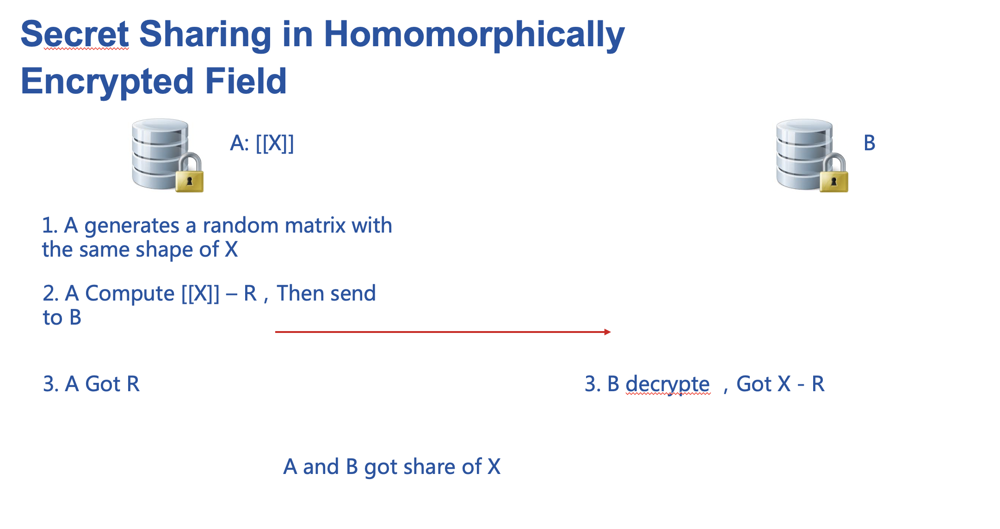
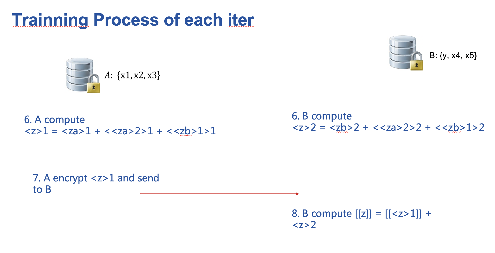

Federated SSHE Logistic Regression
=============================

Logistic Regression(LR) is a widely used statistic model for classification problems. This folder shows a hetero federated LR with both secure sharing and homomorphic encryption. This methods is refer to the following paper: `[paper] <https://arxiv.org/pdf/2008.08753.pdf>`_ We have also made some optimization so that the code may not exactly same with this paper.

We simplified the federation process into three parties. Party A represents Guest， party B represents Host.

To begin with, there are two protocol will be used below.

   Figure 1 (Protocol 1)

.. figure:: ../images/secure_matrix_multiplication.jpg
   :alt: samples
   :width: 500
   :name: Protocol 2
   :align: center

   Figure 2 (Protocol 2)

Use these two protocol, the training process could be described as the following.

.. figure:: ../images/training_1.jpg
   :alt: samples
   :width: 500
   :name: training 1
   :align: center

   Figure 3 Training 1

.. figure:: ../images/training_2.jpg
   :alt: samples
   :width: 500
   :name: training 2
   :align: center

   Figure 4 Training 2

   Figure 5 Training 3

.. figure:: ../images/training_4.jpg
   :alt: samples
   :width: 500
   :name: training 4
   :align: center

   Figure 6 Training 4

.. figure:: ../images/training_5.jpg
   :alt: samples
   :width: 500
   :name: training 5
   :align: center

   Figure 7 Training 5

.. figure:: ../images/training_6.jpg
   :alt: samples
   :width: 500
   :name: training 6
   :align: center

   Figure 8 Training 6

Param
------

.. automodule:: federatedml.param.hetero_sshe_lr_param
   :members:

Features
--------

    1. L1 & L2 regularization

    2. Mini-batch mechanism

    3. Six optimization method:

        :sgd: gradient descent with arbitrary batch size

        :rmsprop: RMSProp

        :adam: Adam

        :adagrad: AdaGrad

        :nesterov_momentum_sgd: Nesterov Momentum

        :sqn: stochastic quansi-newton. The algorithm details can refer to `[this paper] <https://arxiv.org/abs/1912.00513v2>`_

    4. Three converge criteria:

        :diff: Use difference of loss between two iterations, not available for multi-host training;

        :abs: use the absolute value of loss;

        :weight_diff: use difference of model weights

    5. Support validation for every arbitrary iterations

    6. Learning rate decay mechanism

    7. Support OneVeRest

    8. Support early-stopping mechanism

    9. Support setting arbitrary metrics for validation during training
