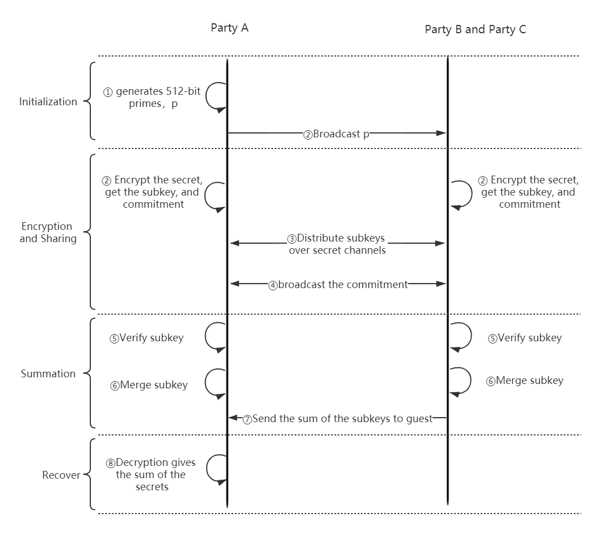
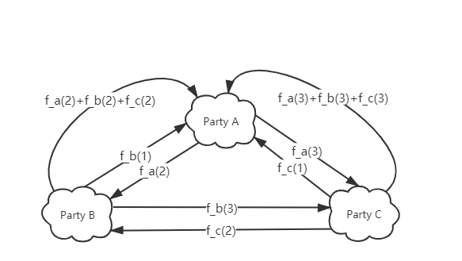

Feldman Verifiable Sum
======================

Introduction
------------

Verifiable secret sharing mechanism is an efficient and practical secret sharing mechanism. Feldman Verifiable sum is
a multi-party private data summation module based on verifiable secret sharing.This component can sum the same feature
of common users among different participants without exposing private data.

Here, three participants of the federation process is given, Party A represents Guest, party B and party C represent Host.
The process of Feldman Verifiable Sum is shown below:

   Figure 1: Process of Feldman Verifiable Sum

   Figure 2: Process of share sub-key

In above process, each party encrypts its own secret value, share sub-key, recieve sub-keys from other parties,
and then combine all these sub-keys. Guest, as the task initiator, initialize the parameters and decrypt the sum result.

How to Use
-------------------

In general, this component can be used in the data preprocessing stage to count some features. It supports integers and
floating-point numbers from - 2 ^ 63 to 2 ^ 64. By default, the maximum precision is set to 6 decimal places.

There is an `[example] <../../../../examples/pipeline/feldman_verifiable_sum>`_

Param
-------------------

:params:

    :sum_cols: list of column index, default: None

    :q_n: int, positive integer less than or equal to 16, default: 6

Features
--------------------

1.Supports summation of floating-point numbers and negative numbers

2.Attacks can be detected when the malicious participant is less than (n-1)/2
