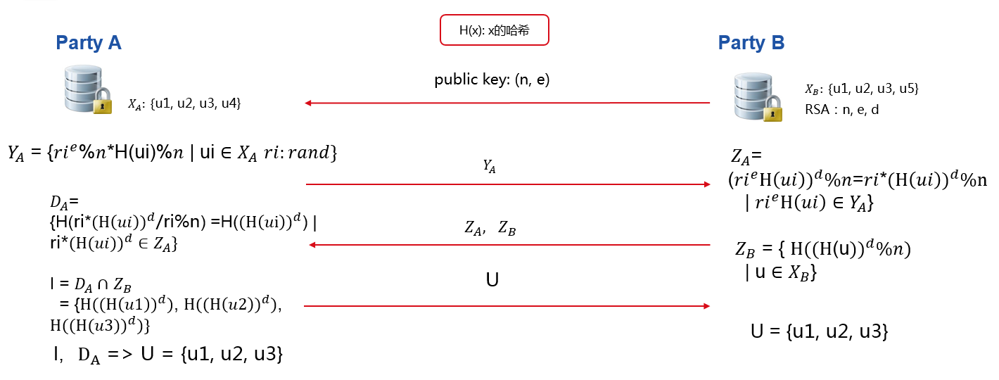
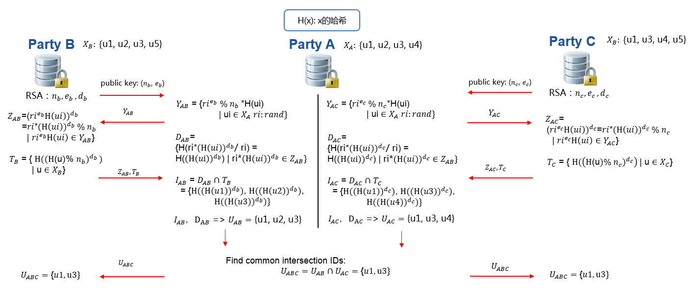

Intersection
============

This module provide some method of PSI(Private Set Intersection)

RSA Intersection
----------------

This mode implements algorithm based on [`RSA Intersection`__]. This work is built on FATE, eggroll and federation API that construct the secure, distributed and parallel infrastructure.

.. __: https://books.google.com.hk/books?id=zfvf37_YS8cC&pg=PA73&lpg=PA73&dq=rsa+commutative+encryption&source=bl&ots=LbOiyIlr3E&sig=IIWlTGeoU0C8dRiN10uH2OAwobQ&hl=zh-CN&sa=X&ved=0ahUKEwiLoozC1tbXAhVDnJQKHbP7DvAQ6AEIdTAJ#v=onepage&q&f=false.

Our Intersection module tries to solve Privacy-Preserving Entity Match problem.
This module helps two and more parties to find common entry ids without leaking non-overlapping ids.
The process is illustrated below in `figure 1`.

   Figure 1 (RSA Intersection between party A and party B)

In `figure 1` ,Party A has user id u1,u2,u3,u4, while Party B has u1,u2,u3,u5. After Intersection,
party A and party B both learn their common user ids, which are u1,u2,u3, while neither party A nor B could decrypt
each other's non-overlapping user ids.
Transmission parties' processed id to the other party, like :math:`Y-A` and :math:`Z-B`,
will not reveal raw ids. Processed :math:`Z-B` is safe due to the privacy key of party B.
Each :math:`Y-A` includes different random value which binds to each value in :math:`X-A` and will be safe as well.

Introduced in FATE version 1.6, `split_calculation` option is available for improved efficiency.
Different from unified process described above, `split_calculation` process first splits hash-processed ids
into even and odd groups; each group then runs through the RSA intersection process with either host or guest as the joining role.
Note than with `split_calculation`, host(s) always know about their common even ids with guest since they are responsible for finding common even ids.

With RSA intersection, participants can get their intersection ids securely and efficiently.

RAW Intersection
----------------

This mode implements the simple intersection method in which a participant sends all its ids to another participant, and the other
participant finds their common ids. Finally, the joining role will send the intersection ids to the sender.

PH Intersection
---------------

This mode implements secure intersection based on symmetric encryption with Pohlig–Hellman commutative cipher.
PH Intersection is also used in `Secure Information Retrieval(SIR) module <../../secure_information_retrieval>`_.

Multi-Host Intersection
-----------------------

RSA, RAW, and PH intersection support multi-host scenario. It means a guest can perform intersection with more than one host simultaneously and get the common ids among all participants.

   Figure 2 (multi-hosts Intersection)

Refer to `figure 2` for a demonstration of one guest running intersection with two hosts; the same process applies to cases with more than two hosts.
First, guest will run intersection with each host and get respective overlapping ids.
Then, guest will find common IDs from all intersection results. Optionally,
guest will send common IDs to every host.

Repeated ID intersection
------------------------

We support repeated id intersection for some applications.
In this case, one should provide the mask id to be mapped to repeated ids.
For instances, in Guest, your data is

::

   mask_id, id, value
   alice_1, alice, 2
   alice_2, alice, 3
   bob, bob, 4

In Host, you data is

::

   id, value
   alice, 5
   bob, 6

After intersection, guest will get the intersection results:

::

   mask_id, value
   alice_1, 2
   alice_2, 3
   bob, 4

And in host:

::

   id, value
   alice_1, 5
   alice_2, 5
   bob, 4

Set parameter `repeated_id_process` to true if you wish to use this mapping function for repeated ids.

Param
------

.. automodule:: federatedml.param.intersect_param
   :members:

Feature
-------

RSA, RAW, and PH intersection methods support:

1. Multi-host modeling task. The detailed configuration for multi-host modeling task is located `here. <../../../../doc/dsl_conf_v2_setting_guide.rst#multi-host-configuration>`_

2. Repeated ID intersection using ID expanding.

3. Configurable hashing methods, including sha256, md5, and sm3; hash operators of RSA intersection can be configured separately, please refer `here <../../param/intersect_param.py>`_ for more details.

RAW intersection supports the following extra feature:

1. base64 encoding may be used for all hashing methods.
